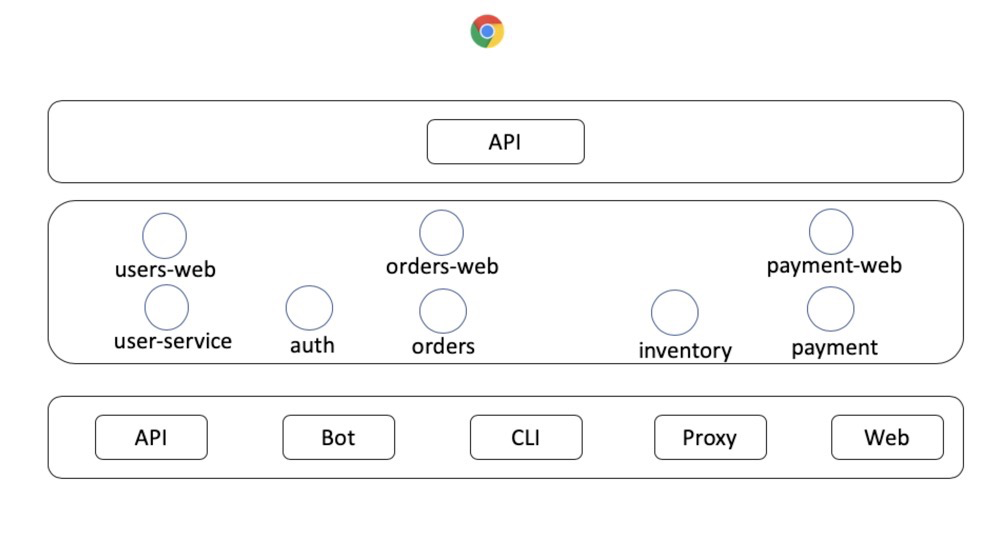

# Micro 构建微服务

我们尝试使用本系列10篇文章向大家介绍如何使用Micro生态链来构建微服务。在我们的[示例教程][examples]中有对每个技术点作了讲解，但是示例能表达的东西毕竟是彼此独立，不成系统，也过于简单。

因此，我们需要用更高的角度，更复杂的代码来演示Micro，本系列应需而生，所以，希望能通过系统教程让大家对用Micro开发微服务有更深入的了解。

在开始之前，我们假设大家对Micro整体有大概的掌握，并且对Golang语法比较熟悉。

在本系列教程中，我们会虚拟一个商业项目，并且会尽可能使用Micro各种技术来实现这个项目，诚然，也会尽可能让使用的技术在业务上尽可能合理，而不为了只使用这技术而已。

不过我们也不会去实现每个细节，比如用户注册与登录，我们就不会做注册功能，新用户直接在数据库里插入即可，因为花太多时间在这些细节上面会让整个项目的侧重点不再偏向Micro本身。

## 什么是微服务

微服务是一种软件架构模式，用来把大而重的应用程序切成许多可管理的、可伸缩的独立服务，各服务之间的通信并不受不同语言的协议影响，每个服务只管做好一件事情。

它与传统单服务应用不同，比如ERP等企业级应用会把所有服务写在一个工程中，通过不同的包封装不同的业务。但是随着系统越来越大，越来越重，维护的成本随之增加，耦合也越来越重，牵一发而动全身，因为所有功能都写在一套代码中。

因此，微服务架构的出现成了必然，把传统应用中模块切成各自独立的子系统，彼此之间通过一定的协议栈通信完成业务计算，各子系统各自维护自己的代码、数据库、上线发布等等，彼此影响降到最低。

诚然，这个行业改变一直进行着，摩尔定律仍在发生影响，我们的计算机资源越来越强大。然而，我们仍没有完全释放这些能力。现存的工具与开发方式没能在新时代中游刃有余。开发者很难找到把大集成的软件代码转到新的高效的设计模式上。大多数公司都不可避免地摸到了大集成应用的天花板，他们需要进行大量的重构工作。像Netflix、Twitter、Alibaba、Tencent，他们都建立了自己的微服务系统平台。

那我们为什么要选择微服务？

这个问题有很多答案，但是都逃不过两个情况：

- 随着业务发展，组织扩大，技术类型与员工数量增加，软件复杂度与之相应增强。
- 子模块并非都是均等向外提供服务，有些模块会承担绝大部分的业务计算，而有的常年可能只处理几次，业务请求大的时常抢占小的资源导致服务故障甚至崩溃。故而，子模块弹性分布需求越来越强烈。

总结下来就是，需要解决**复杂**、**弹性**问题。

## 微服务的优势

1. **弹性开发更简单** - 团队各自围绕不同的业务需求，自己管理他们的服务。

2. **更易于理解** - 微服务通常要更小些，通常只有数千行代码，基于仅千行，或更少。

3. **更适合频繁更新发布的系统** - 服务可以独立部署、扩展和管理。

4. **增强的容错与隔离** - 彼此隔离以最小化彼此之间发现异常的影响。

5. **执行力更强** - 通过独立的开发、发布、管理微服务，团队可以更快交付业务需求。

6. **可复用的服务与快速原型** - 微服务中由生而来的Unix设计理念，可以允许大家复用现有服务和更快地在它之上构建全新的功能。

## 虚拟项目

我们虚拟一个在线书城项目。在线书城是像淘宝一样在线购物商城，支持用户浏览、加购物车、下单、支付，还有库存维护。整个系统会按上面的业务模块拆分成5个微服务，每个微服务的数量不受限制。

### 业务模块

- 用户，users
- 库存，inventory
- 权限，auth
- 订单，orders
- 支付，payment

### 服务抽象结构



用户、订单、支付服务都会有对外暴露接口，故而它们各自有web层。web层app之间不会互相调用，它们只会与非web层的应用交互。

另外，我希望把各自子系统完全独立出来，所以并没有统一web入口，也即只有一个web服务，我们暂不这样做。

## 准备工作

- Golang环境 [安装](https://golang.google.cn/)
- gRPC [安装](https://grpc.io/docs/quickstart/go.html)
- Micro

```bash

## 安装go-micro
go get github.com/micro/go-micro

## 安装micro
go get github.com/micro/micro

```
- mysql


还有其它一些会用到的库或组件，但不是基础依赖，我们会在要用到的章节中再安装。

## 涉及技术与库

Golang，gRPC，Mysql，Redis，Docker，K8s，Go-micro/Micro

### 为什么选用gRPC

微服务因为彼此隔离，它们之间通信需要比较高效且兼容性强的编码方式，gRPC是不错的选择，它有多语言版本，比传统的JSON在数据结构层面的压缩效率高，反序列化性能更好。

更多资料可参考gRPC[官方网站][gRPC]

## 开发环境说明

由于本人用的是MacBook，并且精力有限，有些执行命令没有在多平台上多加测试以兼顾不同朋友的操作系统环境，在此表达歉意。

## 章节结构

- [第一章 用户服务][第一章]
- [第二章 权限服务][第二章]
- [第三章 库存服务、订单服务、支付服务与Session管理][第三章]
- [第四章 使用配置中心][第四章]
- [第五章 日志持久化][第五章]
- [第六章 熔断、降级、容错与健康检查][第六章]
- [第七章 链路追踪][第七章]
- [第八章 容器化][第八章] doing

## 特别声明

- 每一章中的代码都是独立的，这是为了让教程更清晰，如果放在一起，后面章节的代码在前面基础之上改，会让后面章节的代码与前面章节的同时存在，让从头开始的新读者不易理解，所以不同章节有重复代码请大家不要在意。但我们也不用一个章节一个分支来解决这个问题，因为太多分支很难管理

## 引伸阅读

- [Micro中文示例](https://github.com/micro-in-cn/all-in-one)
- [使用Golang编写微服务](https://ewanvalentine.io/microservices-in-golang-part-1/)

## 讨论

朋友，请加入[slack](http://slack.micro.mu/)，进入**中国区**Channel沟通。

[examples]: https://github.com/micro-in-cn/all-in-one
[gRPC]: https://grpc.io/

[第一章]: ./part1
[第二章]: ./part2
[第三章]: ./part3
[第四章]: ./part4
[第五章]: ./part5
[第六章]: ./part6
[第七章]: ./part7
[第八章]: ./part8