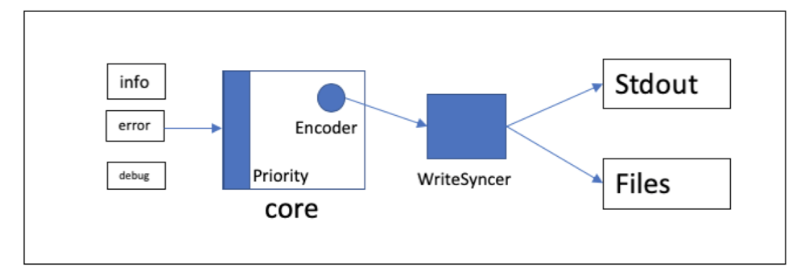

# 第五章 日志持久化

Micro的日志插件[go-log](https://github.com/micro/go-log)并没有提供日志持久化方案，它只一个基于github.com/go-log/log的日志打印接口。

由于目前go-log并不具备设置输出源的能力，我们不去使用它作为日志工具，但是还是要简单讲解一下micro中的日志模块。

本章主要内容

- [介绍go-log](go-log)
- [micro中为什么日志不分级](#为什么Micro中日志不分级)
- [持久化日志](持久化日志)

## go-log

我们先看看**go-log**提供的接口

```go
var (
	// the local logger
	logger log.Logger = golog.New()
)

// Log makes use of github.com/go-log/log.Log
func Log(v ...interface{}) {
	logger.Log(v...)
}

// Logf makes use of github.com/go-log/log.Logf
func Logf(format string, v ...interface{}) {
	logger.Logf(format, v...)
}

// Fatal logs with Log and then exits with os.Exit(1)
func Fatal(v ...interface{}) {
	Log(v...)
	os.Exit(1)
}

// Fatalf logs with Logf and then exits with os.Exit(1)
func Fatalf(format string, v ...interface{}) {
	Logf(format, v...)
	os.Exit(1)
}

// SetLogger sets the local logger
func SetLogger(l log.Logger) {
	logger = l
}
```

源码非常简单，关于打印的总得来说两个接口**Log**和**Fatal**。一个负责打印普通日志，一个则打印致命日志。

还有一个**SetLogger**，则是用来设置默认的日志处理器的。有朋友可能就会产生疑问，特别是从Java转过来的伙伴，为什么没有debug/info/warn/error等常见的日志级别方法。

那么，接下来我们聊聊为什么不要分级。

## 为什么Micro中日志不分级

在Go官方的[log包](https://golang.org/pkg/log/)中，打印日志的方法，并没有根据级别作区分。除非自己实现。更别谈可以像log4j那样的根据实际运行环境只打开某个级别以上日志的指令。

golang官方也提供了相应带级别的日志版本[glog](https://godoc.org/github.com/golang/glog)，它支持如下级别的日志：

- Info
- Warning
- Error
- Fatal

再比如[zap](https://godoc.org/go.uber.org/zap)更丰富

- Info
- Debug
- Error
- Panic
- Warn
- Fatalf
- DPanic
- ...

很明显，为了照顾其它语言的用户，这两个库都或多或少引入了其它语言库的日志风格。

其实日志库应该是要足够简单。

对于debug类型的调试代码不应该保留在生产环境中，它是面向开发者的。

而warning没有谁会关心，因为它不是错误。

至于Info级别，通常都会打印，既然都无论如何都要打印，为什么不直接log呢？

在golang中，通常我们函数的最后一个回参都会是error，而对于error级别的日志，如果我们能够处理这个错误，那说明它不是致命的，既然不是致命的，我们就处理一下，再当成普通日志打出，最后把错误返回调用者。

所以，真正需要的下只有log（logf）方法。

当然，以上都是基于某种设计哲学，并无对错之分。如何取舍是业务技术层面去考虑的，框架只提供参考。

## 持久化日志

我们小篇幅讲解了go-log及为什么Micro日志不分级，现在终于要讲如何实现持久化。

在实际的生产环境中，通常日志是要持久化到本地或者其它存储服务中的，比如db、es等。本章讲解如何使用[**Zap**][zap]作为日志插件，并实现将其持久化到本地文件中。

### 什么是zap

[**Zap**][zap]是Uber出品基于golang的日志工具库，具有高效、简单、结构化，支持分级等特性。

Zap支持以两种模式打印日志

- **结构** 结构模式支持以k/v的方式使用日志打印方法
- **性能** 性能模式则强制要求声明需要打印字段的类型，因为这样除去反射判断类型的时间，性能更好

### 定制zap

我们先在[**plugins**](./plugins)目录中加上zap子目录，在里面编写zap插件。然后直接在应用中引用包即可

zap插件目录 

- [**options.go**](./plugins/zap/options.go) 配置项
- [**zap.go**](./plugins/zap/zap.go) 插件主要代码

我们要zap完成以下功能

- 分级打印
- 持久化到文件
- 不同级别打印到不同文件
- 定时定量维护文件

zap日志可定制性很强，不过，默认的配置不满足我们的需求

我们需要加入插件[lumberjack](https://github.com/natefinch/lumberjack)才能满足需求。

**lumberjack**可以帮助我们生成指定文件名的日志文件，并且它可以维护日志文件，比如过期、压缩等。

安装**lumberjack**

```bash
go get gopkg.in/natefinch/lumberjack.v2
```

### 初始化配置

初始化的所需配置我们写在配置中心[config-grpc-srv](./config-grpc-srv/conf/micro.yml)中

对于每个应用，都需要有自己的配置zap选项，如下：

```yml
micro:
  auth_srv:
    name: mu.micro.book.srv.auth
    address: 127.0.0.1
    port: 9030
    zap:
      level: error
      development: true
      logFileDir:
      outputPaths: []
      maxSize: 50
      maxBackups: 200
      maxAge: 10
```

配置项|说明
---|---
level|打印指定级别及以上的日志
development|是否开发模式
logFileDir|日志文件存放目录
outputPaths|日志输出路径
maxSize|日志文件大小最大值
maxBackups|最大保存文件数
maxAge|最大保存天数

注册zap插件

```go
func init() {
	l = &Logger{
		Opts: &Options{},
	}
	basic.Register(initLogger)
}
```

其它**initLogger**方法中包含了zap的初始化逻辑

### zap初始化

zap 主要组件的工作流程如下图



日志通过zap.Core的Priority判断是否符合本core要打印的级别，如果是则转给encoder编码器，编码完成后交给**WriteSyncer**同步器写到文件中。

我们从同步器WriteSyncer开始入手，日志通常需要输出到控制台与持久化IO接口上，所以我们需要有两个类型的同步器。


**WriteSyncer**

```go
var (
	// ...
	errWS, warnWS, infoWS, debugWS zapcore.WriteSyncer       // IO输出
	debugConsoleWS                 = zapcore.Lock(os.Stdout) // 控制台标准输出
	errorConsoleWS                 = zapcore.Lock(os.Stderr)
)
```

加载配置

```go
func (l *Logger) loadCfg() {

	c := config.C()

	err := c.Path("zap", l.Opts)
	if err != nil {
		panic(err)
	}

    // 如果是开发模式则使用开发配置
	if l.Opts.Development {
		l.zapConfig = zap.NewDevelopmentConfig()
	} else {
		l.zapConfig = zap.NewProductionConfig()
	}
	
	// ...
}
```

设置IO输出同步器，我们定义四种级别的同步器error、warn、info、debug，它们各自负责输出自已级别的日志。

```go
func (l *Logger) setSyncers() {

	f := func(fN string) zapcore.WriteSyncer {
		return zapcore.AddSync(&lumberjack.Logger{
			Filename:   l.Opts.LogFileDir + sp + l.Opts.AppName + "-" + fN,
			MaxSize:    l.Opts.MaxSize,
			MaxBackups: l.Opts.MaxBackups,
			MaxAge:     l.Opts.MaxAge,
			Compress:   true,
			LocalTime:  true,
		})
	}

	errWS = f(l.Opts.ErrorFileName)
	warnWS = f(l.Opts.WarnFileName)
	infoWS = f(l.Opts.InfoFileName)
	debugWS = f(l.Opts.DebugFileName)

	return
}
```

将**priority**与**WriteSyncer**打包到**zap.core**中。

```go
func (l *Logger) cores() zap.Option {

	fileEncoder := zapcore.NewJSONEncoder(l.zapConfig.EncoderConfig)
	
	// ...
	
	errPriority := zap.LevelEnablerFunc(func(lvl zapcore.Level) bool {
		return lvl > zapcore.WarnLevel && zapcore.WarnLevel-l.zapConfig.Level.Level() > -1
	})

    // ...
    
	cores := []zapcore.Core{

		// error 及以上
		zapcore.NewCore(fileEncoder, errWS, errPriority),

		// warn
		zapcore.NewCore(fileEncoder, warnW, warnPriority),

		// ...
	}

	return zap.WrapCore(func(c zapcore.Core) zapcore.Core {
		return zapcore.NewTee(cores...)
	})
}
```

最后通过配置器**zapConfig**生成logger。

```go
    l.Logger, err = l.zapConfig.Build(l.cores())
	if err != nil {
		panic(err)
	}
    
    // Sync负责冲到缓冲区日志，压到文件中
    defer l.Logger.Sync()
```

## 将所有服务日志换成zap

我们用[auth](./auth)服务作示例

1. 在配置中心配置文件[micro.yml](./config-grpc-srv/conf/micro.yml)把zap配置加上：

```yml
micro:
  auth_srv:
    name: mu.micro.book.srv.auth
    address: 127.0.0.1
    port: 9030
    zap:
      level: error
      development: true
      logFileDir:
      outputPaths: []
      maxSize: 50
      maxBackups: 200
      maxAge: 10
```

2. 引入**zap**插件（可忽略，但是建议加上，包管理规范些）

[**plugin.go**](./auth/plugin.go)

```go
package main

import (
	// ...
	_ "github.com/micro-in-cn/tutorials/microservice-in-micro/part5/plugins/zap"
)
```

3. 在需要用到logger的地方使用zap插件暴露的方法**GetLogger**，按需要打印。

[**main.go**](./auth/main.go)

```go
package main

import (
	// ...
	z "github.com/micro-in-cn/tutorials/microservice-in-micro/part5/plugins/zap"
)

var (
	// ...
	log = z.GetLogger()
	// ...
)


func initCfg() {
	// ...
	log.Info("[initCfg] 配置", zap.Any("cfg", cfg))
	return
}
```

4. 启动服务后便会打印日志：

```bash
go run main.go plugin.go

## ...
1.557376266044878e+09   info    auth/main.go:97 [initCfg] 配置  {"cfg": {"name":"mu.micro.book.srv.auth","version":"","address":"127.0.0.1","port":9030}}
## ...
```

并在当前目录下的logs目录会有新的日志文件生成：

```bash
ls logs/

## 日志文件
app-debug.log   app-error.log   app-info.log    app-warn.log
```

## 其它持久化方案

- [filebeat](https://www.elastic.co/products/beats/filebeat) 侦听日志文件变动推送到ELK

## 总结

我们本篇简单介绍micro中的go-log，并引入zap作为我们的日志持久化插件，给大家演示了如何使用zap分级打印，如何持久化到文件。

其实zap还有很多功能，比如定制日志格式、增加field，我们不一一介绍。

[下一篇][第六章]我们会讲解在micro中如何使用熔断、降级、容错与健康检查。

## 参考阅读

[聊聊日志打印](https://dave.cheney.net/2015/11/05/lets-talk-about-logging)

## 系列文章

- [第一章 用户服务][第一章]
- [第二章 权限服务][第二章]
- [第三章 库存服务、订单服务、支付服务与Session管理][第三章]
- [第四章 使用配置中心][第四章]
- [第六章 熔断、降级、容错与健康检查][第六章]
- [第七章 链路追踪][第七章]
- [第八章 容器化][第八章]

[第一章]: ../part1
[第二章]: ../part2
[第三章]: ../part3
[第四章]: ../part4
[第五章]: ../part5
[第六章]: ../part6
[第七章]: ../part7
[第八章]: ../part8
[zap]: https://github.com/uber-go/zap